# A 股 BP 估值因子测试框架复现报告

> 复现对象：山西证券研报《因子测试框架和估值因子初测》中的估值因子测试思路。  
> 当前版本聚焦 **BP（Book-to-Market，账面市值比）因子**，完成了因子清洗、标准化、中性化、IC 检验、截面回归、t 值时序分析、分层回测和多空组合绩效分析。

---

## 1. 项目结论概览

本项目的大体流程是完整且合理的。Notebook 已经覆盖一个单因子研究中最核心的几步：

1. 构建月度 A 股股票池；
2. 对 BP 因子进行异常值处理和截面标准化；
3. 分别构建原始因子、行业中性因子、行业+市值中性因子；
4. 使用下期收益计算 IC、RankIC、ICIR 和 t 检验；
5. 使用 WLS 和 RLM 截面回归检验因子收益和 t 值稳定性；
6. 使用五分组回测检验因子收益单调性；
7. 构建高 BP 组减低 BP 组的多空组合，并计算年化收益、波动率、Sharpe、最大回撤、胜率等绩效指标。

从结果看，**BP 因子在 2010-2020 年 A 股样本中整体呈现正向选股能力**。尤其在完成行业和市值中性化之后，IC、RankIC 和分层收益单调性都有明显改善，说明 BP 因子的有效性不是单纯来自行业暴露或市值暴露，而是仍保留了一定的独立解释力。

不过，当前版本更适合作为“因子研究复现框架”，还不能直接等同于可实盘交易策略。后续如果要进一步提升严谨性，需要补充交易成本、换手率、停牌/涨跌停可交易性处理、分阶段稳健性检验，以及 EP 等其他估值因子的横向对比。

---

## 2. 数据范围与股票池构建

### 2.1 测试区间

本次复现使用的测试区间为：

- 起始日期：`2010-01-01`
- 结束日期：`2020-01-01`
- 调仓频率：月频
- 日期选择方式：每个月最后一个交易日作为截面日期

代码中先通过 RiceQuant 的交易日接口获取全部交易日，然后按月份聚合，取每个月最后一个交易日作为因子计算和持仓调整的时间点。

由于最后一个月没有下一期收益，因此最终用于收益检验的有效月份数为 **119 个月**。

### 2.2 股票池筛选逻辑

每个月截面上，代码对 A 股股票池进行了三层过滤：

| 过滤条件 | 目的 |
|---|---|
| 剔除 ST 股票 | 避免财务异常或交易风险较高的股票影响因子测试 |
| 剔除停牌股票 | 避免无法交易或价格不可获得的股票进入组合 |
| 剔除上市不足两年的股票 | 避免新股定价不稳定、财务数据不完整带来的干扰 |

具体实现上，代码分别定义了：

- `adjust_st(date)`：剔除 ST 股票；
- `adjust_suspended(date)`：剔除停牌股票；
- `adjust_length(date)`：剔除上市未满两年的股票；
- `final_A(date)`：取三个筛选结果的交集，得到最终股票池。

以测试日期 `2010-07-30` 附近的样本为例，筛选后股票池规模约为一千多只。整个 2010-2020 年期间，因子数据在剔除非正 BP 后得到 **255,629 条股票-月份观测值**。

---

## 3. 因子构建与预处理

### 3.1 原始 BP 因子

本项目使用 RiceQuant 中的：

```text
book_to_market_ratio_lf
```

作为 BP 因子。其含义是账面市值比，即：

$$
BP_{i,t} = \frac{BookValue_{i,t}}{MarketValue_{i,t}}
$$

一般而言，BP 越高，代表股票估值越低；如果价值效应成立，则高 BP 股票未来收益应当更高。

### 3.2 剔除非正 BP

代码中先剔除了 BP 小于等于 0 的样本：

```text
book_to_market_ratio_lf <= 0
```

当前 notebook 输出显示，非正 BP 样本数为 **313 条**。剔除这部分样本是合理的，因为 BP 为负通常意味着净资产为负，经济含义与常规估值因子不同，容易对截面排序产生干扰。

### 3.3 原始 BP 分布观察

代码选取了一个月度截面观察 BP 分布，发现原始 BP 呈明显右偏，存在极端高值。


这一步是必要的，因为估值类因子通常具有偏态和厚尾特征。如果直接进行 z-score 标准化，极端值会明显影响均值和标准差，从而影响后续排序、IC 和回归结果。

### 3.4 调整 Boxplot 缩尾

由于 BP 分布右偏，项目没有使用简单的均值标准差缩尾，而是使用了 adjusted boxplot 方法。该方法通过 medcouple 衡量分布偏度，并根据偏度动态调整上下界。

当 medcouple 大于等于 0 时，缩尾区间为：

$$
L = Q_1 - 1.5 \cdot e^{-3.5MC} \cdot IQR
$$

$$
U = Q_3 + 1.5 \cdot e^{3.5MC} \cdot IQR
$$

当 medcouple 小于 0 时，缩尾区间为：

$$
L = Q_1 - 1.5 \cdot e^{-4MC} \cdot IQR
$$

$$
U = Q_3 + 1.5 \cdot e^{4MC} \cdot IQR
$$

这种方法比普通 boxplot 更适合处理偏态分布。对于 BP 这种右偏明显的估值因子，这个选择是合理的。

### 3.5 截面 z-score 标准化

缩尾后，对每个月截面的 BP 进行 z-score 标准化：

$$
zBP_{i,t} = \frac{BP_{i,t} - \mu_t}{\sigma_t}
$$

其中，$\mu_t$ 和 $\sigma_t$ 分别是第 $t$ 月截面 BP 的均值和标准差。


标准化后的好处是：不同月份的因子值被放到同一尺度上，便于跨期比较，也便于后续回归和分组。

---

## 4. 行业中性化与市值中性化

估值因子经常与行业和市值暴露高度相关。例如，银行、地产等行业天然 BP 较高，成长行业天然 BP 较低；小市值股票和大市值股票的估值特征也不同。因此，直接使用原始 BP 可能会混入行业和市值效应。

本项目分别构建了三类因子：

| 因子版本 | 变量名 | 含义 |
|---|---|---|
| 原始标准化 BP | `BP_zscore` | 缩尾后做月度截面标准化 |
| 行业中性 BP | `BP_industry_neutral_z` | 减去申万一级行业内均值后再标准化 |
| 行业+市值中性 BP | `BP_neutral_z` | 对行业哑变量和市值变量回归取残差，再标准化 |

### 4.1 行业中性化

行业中性化的处理方式为：

$$
BP^{ind}_{i,t} = zBP_{i,t} - \overline{zBP}_{industry(i),t}
$$

即每只股票的 BP 标准化值减去其所在申万一级行业当月的平均 BP 标准化值。

随后再对行业中性化后的结果进行月度截面 z-score 标准化，得到：

```text
BP_industry_neutral_z
```

从 notebook 输出看，原始 BP 的截面标准差稳定为 1；行业中性化后，截面标准差均值约为 **0.87**，说明行业均值暴露确实解释了一部分 BP 的截面差异。

### 4.2 市值数据处理

市值变量使用：

```text
market_cap_3
```

处理流程为：

1. 对市值取对数；
2. 按月度截面做 1% 和 99% 分位缩尾；
3. 按月度截面做 z-score 标准化。

数学表达为：

$$
logMV_{i,t} = \log(MV_{i,t})
$$

$$
zlogMV_{i,t} = \frac{logMV_{i,t} - \mu_{logMV,t}}{\sigma_{logMV,t}}
$$

这样可以降低市值分布极端右偏对回归的影响。

### 4.3 行业+市值中性化

行业和市值联合中性化采用截面 OLS 回归：

$$
zBP_{i,t} = \alpha_t + \beta_t zlogMV_{i,t} + \sum_k \gamma_{k,t} IndustryDummy_{i,k,t} + \epsilon_{i,t}
$$

其中，残差 $\epsilon_{i,t}$ 即为剔除行业和市值影响后的 BP 因子。最后再对残差做截面 z-score 标准化，得到：

```text
BP_neutral_z
```

这个版本是后续检验中表现最好的因子版本，也是本报告重点分析的最终因子。

---

## 5. 收益率构建

### 5.1 下期收益

代码使用每个月末的前复权收盘价计算下一期月收益：

$$
r_{i,t+1} = \frac{P_{i,t+1}}{P_{i,t}} - 1
$$

其中，$P_{i,t}$ 是本月月末收盘价，$P_{i,t+1}$ 是下个月月末收盘价。

### 5.2 截面超额收益

为了进行截面回归，代码还计算了相对当月全市场等权平均收益的超额收益：

$$
r^{excess}_{i,t+1} = r_{i,t+1} - \frac{1}{N_t}\sum_{i=1}^{N_t}r_{i,t+1}
$$

这样可以去掉当月市场整体涨跌对个股收益的共同影响，使回归更聚焦于因子在截面上的解释力。

---

## 6. IC 与 RankIC 检验

### 6.1 检验方法

IC 衡量因子值和下一期收益的线性相关性：

$$
IC_t = corr(f_{i,t}, r_{i,t+1})
$$

RankIC 衡量因子排序和下一期收益排序的 Spearman 相关性：

$$
RankIC_t = corr(rank(f_{i,t}), rank(r_{i,t+1}))
$$

ICIR 定义为：

$$
ICIR = \frac{mean(IC)}{std(IC)}
$$

IC 的 t 值定义为：

$$
t = \frac{mean(IC)}{std(IC)/\sqrt{T}}
$$

### 6.2 IC 结果

| 因子版本 | IC均值 | IC标准差 | ICIR | IC t值 | IC为正比例 | RankIC均值 | RankICIR | RankIC t值 | RankIC为正比例 |
|---|---:|---:|---:|---:|---:|---:|---:|---:|---:|
| BP_ori | 0.0128 | 0.1503 | 0.0849 | 0.9266 | 49.58% | 0.0361 | 0.2220 | 2.4220 | 57.14% |
| BP_ind | 0.0193 | 0.1003 | 0.1923 | 2.0977 | 52.10% | 0.0390 | 0.3729 | 4.0683 | 60.50% |
| BP_both | 0.0223 | 0.0924 | 0.2416 | 2.6359 | 52.94% | 0.0426 | 0.4387 | 4.7858 | 61.34% |

### 6.3 IC 结果解读

从 IC 结果看，三个版本的 BP 因子均为正，但强度不同：

1. **原始 BP 的线性 IC 较弱**  
   原始 BP 的 IC 均值为 0.0128，t 值为 0.9266，统计显著性不足。这说明未经中性化的 BP 可能混入了行业和市值噪声。

2. **行业中性后 IC 明显改善**  
   行业中性 BP 的 IC 均值提升到 0.0193，IC t 值提升到 2.0977，说明行业暴露剔除后，因子的截面预测能力更清晰。

3. **行业+市值中性后效果最好**  
   行业+市值中性 BP 的 IC 均值为 0.0223，ICIR 为 0.2416，IC t 值为 2.6359，是三个版本中最优的。

4. **RankIC 比 IC 更稳定**  
   三个版本的 RankIC t 值均高于 IC t 值。最终因子 `BP_neutral_z` 的 RankIC t 值达到 4.7858，说明 BP 因子的“排序能力”比线性收益解释能力更稳定。这对于分层组合尤其重要，因为分层回测本质上依赖的是因子排序。

### 6.4 累计 IC 图

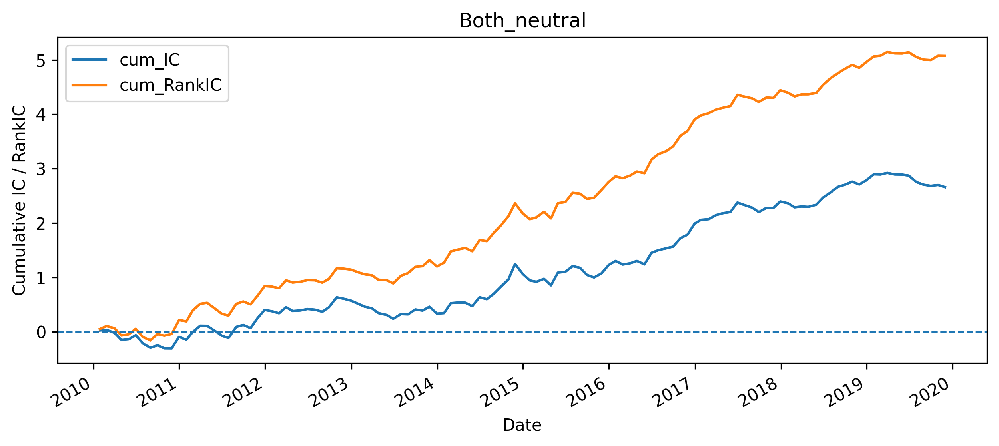

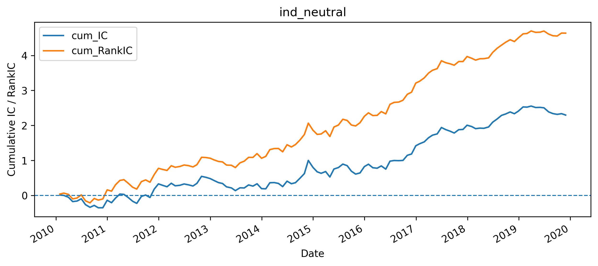

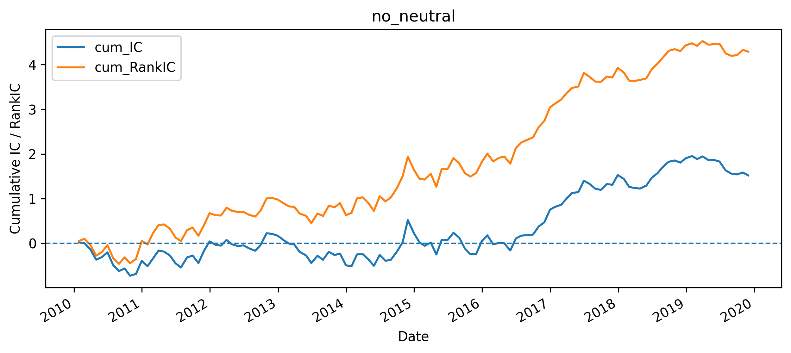

累计 IC 图用于观察因子是否长期稳定。如果累计 IC 长期向上，说明因子在多数时间段内具有持续正向预测能力；如果长期震荡或阶段性大幅回撤，则说明因子稳定性不足。

从当前结果看，中性化后的累计 IC 表现明显优于原始 BP，尤其是行业+市值中性后的因子更适合作为最终版本。

---

## 7. 截面回归检验：WLS 与 RLM

### 7.1 回归设定

每个月截面上，使用因子值解释下一期超额收益：

$$
r^{excess}_{i,t+1} = \alpha_t + \beta_t f_{i,t} + \epsilon_{i,t+1}
$$

其中，$\beta_t$ 可以理解为当月的因子收益，$\beta_t$ 的 t 值用于衡量该月因子收益是否显著。

本项目使用两种方法：

| 方法 | 含义 |
|---|---|
| WLS | 加权最小二乘，代码中使用市值开方作为权重，使大市值股票在回归中权重更高 |
| RLM | 稳健线性回归，使用 HuberT 损失函数降低极端收益点对回归结果的影响 |

### 7.2 t 值汇总结果

| 模型 | t值均值 | t值标准差 | t值为正比例 |
|---|---:|---:|---:|
| WLS_ori | 0.6330 | 9.2722 | 47.06% |
| WLS_ind | 0.8310 | 6.0465 | 50.42% |
| WLS_both | 0.8726 | 5.4225 | 53.78% |
| RLM_ori | 1.4760 | 7.9205 | 57.14% |
| RLM_ind | 1.5982 | 5.1457 | 58.82% |
| RLM_both | 1.6864 | 4.6939 | 58.82% |

### 7.3 回归结果解读

1. **中性化提升了 t 值表现**  
   无论是 WLS 还是 RLM，行业+市值中性因子的 t 值均值都高于原始因子，t 值标准差也明显下降。这说明中性化不仅提高了平均预测能力，也降低了不稳定性。

2. **RLM 的结果整体强于 WLS**  
   RLM 的 t 值均值更高，且正 t 值比例更高。原因可能是 A 股个股月收益中存在较多极端值，RLM 对极端收益更不敏感，因此能更稳定地估计因子收益。

3. **t 值仍存在明显时变性**  
   虽然最终因子的 RLM t 值均值达到 1.6864，但 t 值标准差仍然较大，说明 BP 因子不是每个月都有效。估值因子通常具有周期性，容易受到市场风格、风险偏好和宏观环境影响。

### 7.4 t 值时序图

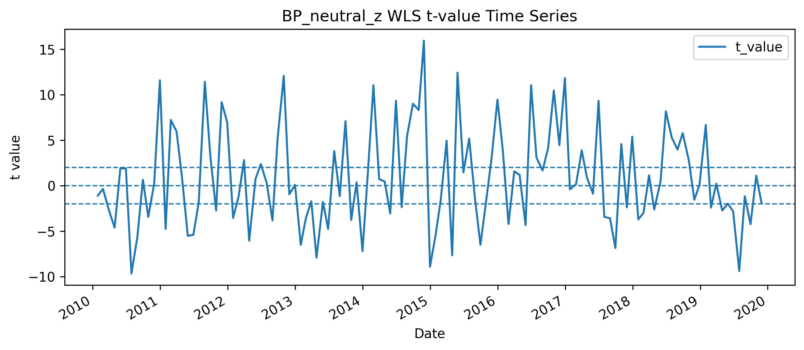

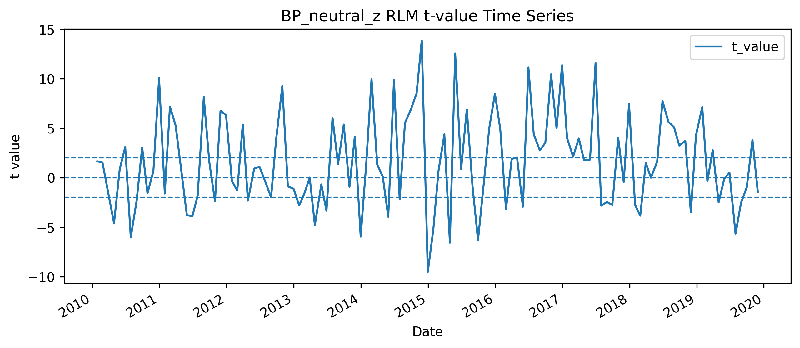

t 值时序图可以进一步判断因子有效性是否集中在少数月份。如果 t 值长期围绕正值波动，说明因子稳定性较好；如果大部分月份接近 0，仅少数月份贡献显著，则说明因子依赖特定市场环境。

当前结果显示，BP 因子整体偏正，但存在明显阶段波动。因此后续建议继续做分阶段检验，例如：

- 2010-2014 年；
- 2015 年牛熊切换阶段；
- 2016-2019 年；
- 2020 年之后的样本外检验。

---

## 8. 分层回测分析

### 8.1 分组方法

每个月截面上，根据因子值从低到高分为 5 组：

| 组别 | 含义 |
|---|---|
| Group 1 | BP 最低，即估值最高的一组 |
| Group 2 | BP 较低 |
| Group 3 | BP 中等 |
| Group 4 | BP 较高 |
| Group 5 | BP 最高，即估值最低的一组 |

每组采用等权月度收益。多空组合定义为：

$$
LongShort_t = R_{Group5,t} - R_{Group1,t}
$$

如果 BP 因子有效，则 Group 5 的长期净值应高于 Group 1，多空组合应获得正收益。

### 8.2 分层净值图

#### 行业+市值中性 BP

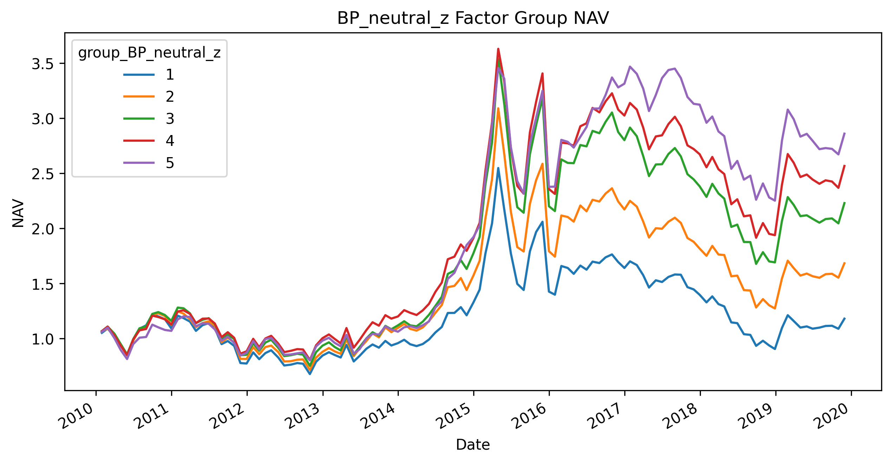

#### 行业中性 BP

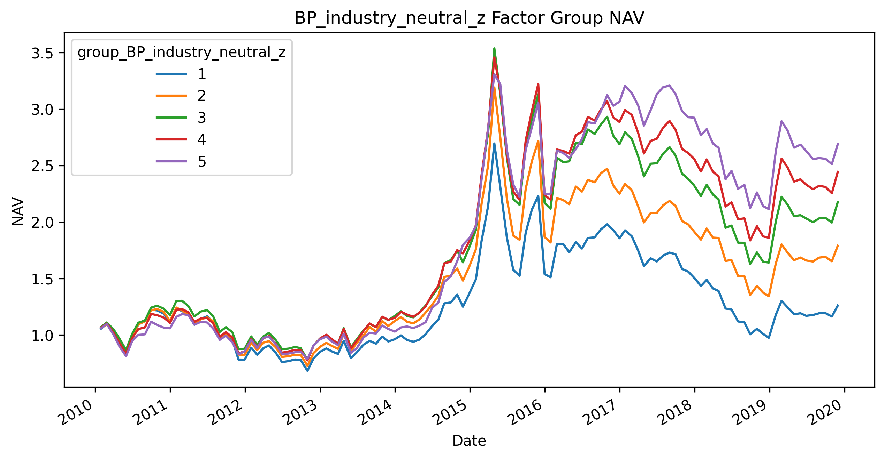

#### 原始 BP

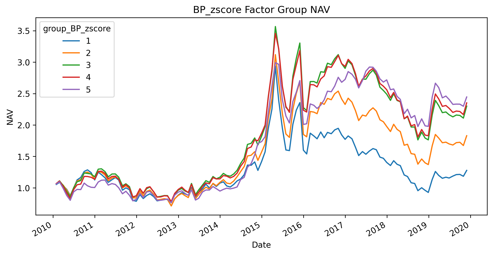

从分层净值看，最终版本 `BP_neutral_z` 的分层效果较为清晰：因子值越高，长期净值整体越高。Group 5 长期表现最好，Group 1 长期表现最弱，说明 BP 因子具有较好的单调性。

### 8.3 多空组合净值

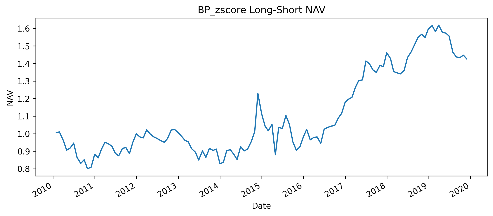

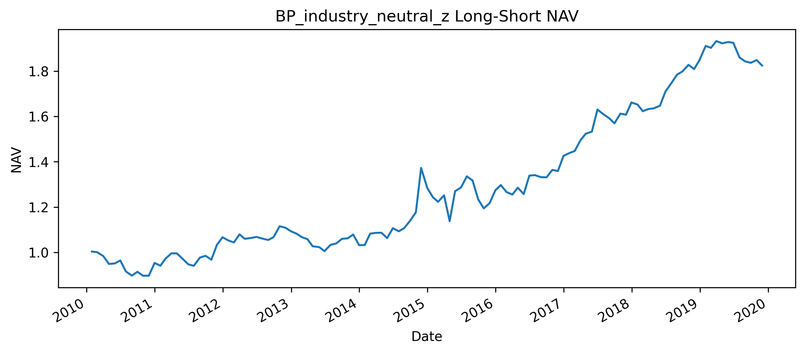

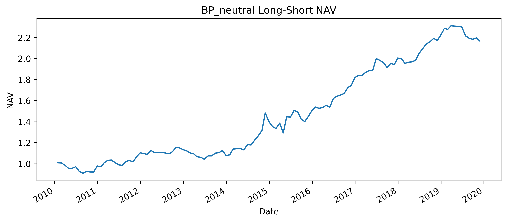

多空净值用于观察因子纯排序收益。最终中性化版本的多空组合长期向上，说明高 BP 股票相对低 BP 股票具有持续超额收益。

---

## 9. 最终因子绩效表现

以下为最终因子 `BP_neutral_z` 的五分组与多空组合绩效：

| 组合 | 年化收益 | 年化波动 | Sharpe | 最大回撤 | 月度胜率 | 平均月收益 |
|---|---:|---:|---:|---:|---:|---:|
| Group 1 | 1.69% | 30.20% | 0.0560 | -64.48% | 48.74% | 0.52% |
| Group 2 | 5.39% | 30.70% | 0.1757 | -58.79% | 50.42% | 0.83% |
| Group 3 | 8.42% | 30.97% | 0.2721 | -52.56% | 51.26% | 1.07% |
| Group 4 | 9.98% | 29.96% | 0.3330 | -47.24% | 52.10% | 1.17% |
| Group 5 | 11.18% | 28.04% | 0.3988 | -35.07% | 55.46% | 1.21% |
| Long-Short | 8.11% | 9.93% | 0.8167 | -12.84% | 53.78% | 0.69% |

### 9.1 绩效解读

1. **收益具有较强单调性**  
   从 Group 1 到 Group 5，年化收益大体递增，说明 BP 因子排序有效。

2. **高 BP 组风险收益比更好**  
   Group 5 不仅年化收益最高，而且最大回撤显著低于 Group 1。这说明高 BP 组合在样本期内不仅收益更高，风险也相对更可控。

3. **多空组合表现较好**  
   多空组合年化收益约为 8.11%，年化波动约为 9.93%，Sharpe 达到 0.8167，最大回撤约为 -12.84%。这说明因子的相对收益比较稳定。

4. **胜率不算特别高，但长期收益为正**  
   多空组合月度胜率为 53.78%，并不是极高胜率型因子，而是依靠长期小幅优势积累收益。这符合很多传统价值因子的特征。

---

## 10. 当前流程的优点

### 10.1 复现框架完整

当前 notebook 已经不是简单画净值，而是包含了较完整的因子研究链条：

- 股票池构建；
- 因子获取；
- 异常值处理；
- 标准化；
- 行业中性化；
- 市值中性化；
- 下期收益构建；
- IC / RankIC；
- WLS / RLM；
- t 值汇总与时序图；
- 分层回测；
- 多空组合；
- 绩效评价。

这已经符合一个基础因子研究项目应有的主线。

### 10.2 中性化前后对比清晰

项目没有只展示最终因子，而是同时比较：

- 原始 BP；
- 行业中性 BP；
- 行业+市值中性 BP。

这个设计很好，因为它可以证明最终效果不是“凑出来的”，而是能看到每一步处理对结果的边际改善。

### 10.3 同时使用 IC、回归和分层回测

单一指标容易误判。当前项目同时使用相关性检验、截面回归和组合回测，能够从不同角度验证因子有效性：

- IC / RankIC：看预测相关性；
- WLS / RLM：看截面因子收益和显著性；
- 分层回测：看组合收益单调性；
- 多空组合：看因子纯收益。

这比只画净值曲线更有说服力。

---

## 11. 最终结论

本次 BP 估值因子复现已经完成了一个较完整的单因子测试框架。结果显示：

1. BP 因子在 2010-2020 年 A 股样本中具有正向选股能力；
2. 原始 BP 因子受到行业和市值暴露影响，直接使用时 IC 显著性较弱；
3. 行业中性化后，IC、RankIC 和 t 值均有改善；
4. 行业+市值中性化后的 BP 因子表现最好，RankIC 均值约为 0.0426，RankIC t 值约为 4.7858；
5. 分层回测中，高 BP 组长期收益高于低 BP 组，收益单调性较清晰；
6. 最终多空组合年化收益约为 8.11%，Sharpe 约为 0.8167，最大回撤约为 -12.84%，说明因子具有一定稳定性；
7. 当前结果适合作为因子研究复现项目展示，但如果要进一步转化为策略，还需要加入交易成本、换手率、样本外检验和更多因子对比。

